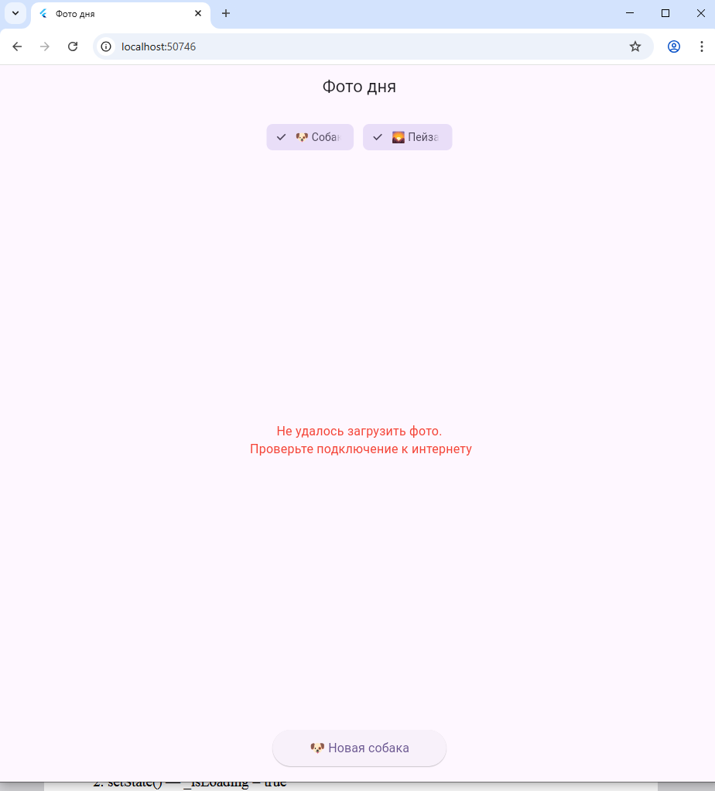

# Лабораторная работа №5. Асинхронность в Dart и Flutter. 

Приложение для просмотра случайных фотографий, которое демонстрирует работу с асинхронностью в Dart и Flutter.

## Информация об авторе
* **Имя:** Дунюшкин Н.С | Салалыкина О.М
* **Группа:** ИСП-233

## Стек и версии
* **Flutter:** 3.41.8
* **Dart:** 3.11.5
* **Платформа:** Web (Edge)
* **Пакет:** http (^1.6.0)

## Скриншот приложения

## Запуск
1. `git clone <url>`
2. `cd photo_of_the_day`
3. `flutter pub get`
4. `flutter run -d chrome`

## Что изучили
* **Future<T>**: Объект-обещание, который вернёт значение типа T в будущем.
* **async**: Ключевое слово, помечающее функцию как асинхронную и разрешающее использование `await`.
* **await**: Приостанавливает выполнение функции до завершения `Future`, не блокируя при этом основной поток выполнения.
* **try/catch**: Механизм обработки ошибок, возникающих в асинхронном коде.
* **http.get()**: Метод для отправки GET-запроса, возвращающий `Future<Response>`.

## Ответы на вопросы

**1. Что такое Future<T>? Чем отличается от обычного возвращаемого значения?**
Это объект-обещание, который сигнализирует о том, что значение типа T будет получено в будущем.В отличие от обычного значения, которое доступно немедленно, `Future` позволяет программе продолжать работу, пока результат вычисления или запроса ещё не готов.

**2. Что делает await? Блокирует ли он весь поток выполнения?**
`await` приостанавливает выполнение текущей асинхронной функции до тех пор, пока `Future` не завершится.Он **не блокирует** весь поток выполнения программы (интерфейс остаётся отзывчивым), так как Dart использует событийный цикл для обработки других задач.

**3. Зачем setState() вызывается дважды в _fetchPhoto()?**
Первый вызов `setState()` происходит перед началом загрузки (устанавливает `_isLoading = true`), чтобы показать индикатор загрузки и сбросить предыдущий результат. Второй вызов происходит после завершения запроса (устанавливает `_isLoading = false`), чтобы скрыть индикатор и отобразить полученные данные.

**4. Почему кнопке передаётся _fetchPhoto без скобок, а не _fetchPhoto()?**
Передача без скобок передаёт **ссылку** на функцию, которую кнопка вызовет позже при нажатии.Использование скобок `_fetchPhoto()` вызвало бы функцию немедленно в момент построения виджета

**5. Чем Image.network() отличается от Image.asset()?**
`Image.network()` загружает и отображает изображение из интернета по URL. `Image.asset()` отображает изображение, которое является частью ресурсов приложения (хранится локально в проекте)